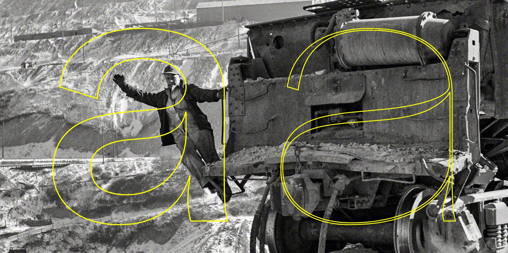
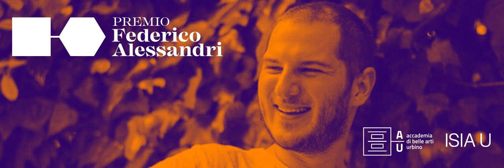

#Anthropocene.otf

**Anthropocene.otf** is a free parametric typeface that is linked to an air quality index which dynamically and constantly changes its design, following your local current air status trends.

Its aim is to stimulate proactive solutions to climate change, pollution issues and any other factors related to the decay of our planet's health.
**Anthropocene.otf** is unlike any other parametric font — no moving sliders around or pushing buttons.
This font dynamically changes its look according to the AQI value of your nearest control station.
The only way to change Anthropocene.otf’s appearance is by taking action in the real world by reducing one’s own carbon footprint and promoting virtuous behavior.

The core of this project was to develop a parametric font modified, in its nature, by the concept that inspired us to create it in the first place: the impact of humans’ carbon footprint on the environment.
This font dynamically changes its look according to the AQI value of your nearest control station.

**Anthropocene.otf** was developed for the biennal Federico Alessandri Prize I edition of 2019, organized through collaboration between the Italian Academy of Fine Arts and the ISIA of Urbino in memory of the talented and beloved student Federico.

The authors of Anthropocene.otf are [Michelangelo Alesi](http://portfolio.michelangeloalesi.it/), Elia Chiarucci, [Gianluca Ciancaglini](https://www.behance.net/gianluca_ciancaglini) and [Amedeo Mencarini](https://www.behance.net/amedeomencarini).

[Academy of Fine Arts, Urbino](https://www.accademiadiurbino.it/)
[ISIA, Urbino](https://isiaurbino.net/)